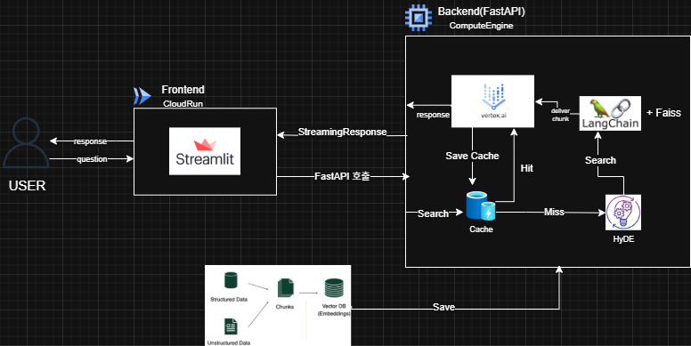
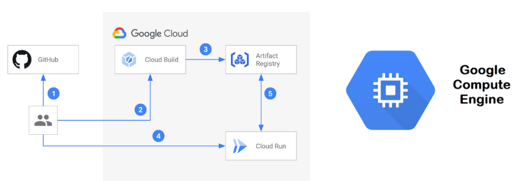

# Radiation QA ChatBot

- [사용/기능 설명서](https://www.notion.so/Radiation-QA-System-21a7f9017bbe80059da7f1b8801ee37e?source=copy_link)

## 1. 프로젝트 설명

**Radiation QA ChatBot**은 방사선 품질관리(QA) 문서에 기반하여 사용자의 질문에 정확하고 신뢰성 있는 답변을 제공하는 **RAG 기반 챗봇 시스템**입니다.  
HyDE 기반 임베딩 방식과 캐싱을 적용해 **빠르고 일관된 응답**을 제공하며, GCP의 Vertex AI를 활용해 실제 QA 환경에서 사용할 수 있는 실용성을 목표로 합니다.


- **문서 기반 QA**: 업로드된 문서를 벡터화하여 의미 기반 검색
- **RAG 방식 + HyDE 적용**: 질문의 의미를 확장 후 벡터 검색 → Gemini 모델로 응답 생성
- **응답 속도 개선**: LRU 메모리 캐시 + 파일 캐시로 자주 묻는 질문에 빠르게 응답
- **Streamlit UI 제공**: 사용자 친화적인 웹 기반 인터페이스

---

## 2. 프로젝트 구조

**SystemArchitecture**


```
CapstoneProject/
├── embed_chunk/        # 문서 임베딩 생성
│   ├── create_embeddings.py
│   └── requirements.txt
├── evaluate/           # 챗봇 성능 평가
│   ├── final_test/
│   ├── unified_test/
│   ├── prompt_test/
│   └── rag_test/
├── fastapi_server/     # FastAPI 서버: 벡터 검색 및 Gemini 응답
│   ├── embed_faiss/    # 생성된 FAISS 인덱스 저장
│   ├── cache.json      # 캐시 파일
│   ├── main.py         # FastAPI 메인 서버 코드
│   ├── nohup.out
│   └── requirements.txt
├── streamlit/          # Streamlit 데모 인터페이스
│   ├── app.py
│   ├── Dockerfile
│   └── requirements.txt
└── README.md
```

---

## 3. 설치 방법

1. **레포지토리 클론**
```bash
git clone https://github.com/your-org/Radiation-QA-ChatBot.git
cd CapstoneProject
```

2. **가상환경 생성 및 활성화**
```bash
python -m venv venv
source venv/bin/activate  # macOS/Linux
# venv\Scripts\activate   # Windows
```

3. **라이브러리 설치**
```bash
pip install -r embed_chunk/requirements.txt
pip install -r fastapi_server/requirements.txt
pip install -r streamlit/requirements.txt
```

4. **FAISS 벡터 DB 생성**
```bash
cd embed_chunk
python create_embeddings.py
```

> HyDE를 활용한 질문 임베딩이 자동 생성됨  
> 결과 파일은 `fastapi_server/embed_faiss/`에 저장됨

---

## 4. 사용 방법

1. **FastAPI 서버 실행**
```bash
cd fastapi_server
uvicorn main:app --reload
```

2. **Streamlit 앱 실행**
```bash
cd streamlit
streamlit run app.py
```

3. **브라우저 접속**
```
http://localhost:8501
```

---

## 5. 기술 스택 및 특징

| 구성 요소 | 설명 |
|-----------|------|
| **HyDE 임베딩** | 질문 자체를 임베딩할 뿐 아니라, 질문에서 가상의 답변을 생성 → 이 답변을 임베딩하여 유사 문서 검색 정확도 향상 |
| **Vector Store (FAISS)** | HuggingFace 임베딩을 기반으로 벡터 DB 구성 |
| **Embeddings** | `distiluse-base-multilingual-cased-v1` 모델 사용 |
| **LangChain** | 검색-생성 파이프라인 구성 프레임워크 |
| **Vertex AI Gemini** | 응답 생성에 사용되는 LLM (GenerativeModel 사용) |
| **캐싱 구조** | LRUCache (in-memory) + JSON 파일 캐시 (persistent) 이중 구조로 응답 속도 최적화 |
| **Cloud Run / GCE** | Docker 기반 Streamlit 앱을 GCP에서 배포 가능 |

## 6. 문제 해결 전략

### LLM 응답 비용 증가

- **문제**: HyDE 방식은 질문마다 LLM 호출이 필요해 호출량 누적 시 비용 부담
- **해결책**: HyDE 응답 캐싱을 통해 동일 질문에 대해 응답을 재사용하여 LLM 호출 최소화
  - SHA256 해시 기반 파일 캐시 시스템 구축 (`hypo_cache.json`) → 메모리 감소

- **관련 코드**:
  - 메모리 캐시 설정:
    ```python
    cache = LRUCache(maxsize=200) # 메모리 캐시 (핫 캐시)
    ```
  - 캐시 저장 함수:
    ```python
    def save_cache_to_disk():
        # 캐시를 디스크에 저장하는 함수
        with open(CACHE_FILE, 'w', encoding='utf-8') as f:
            json.dump(dict(cache.items()), f, ensure_ascii=False, indent=4)
    ```
  - 캐시 로드 함수:
    ```python
    def load_cache_from_disk():
        # 디스크에서 캐시를 로드하는 함수
        if os.path.exists(CACHE_FILE):
            with open(CACHE_FILE, 'r', encoding='utf-8') as f:
                data = json.load(f)
                cache.update(data)
    ```

**기대 효과**

- 최초 1회 생성 후 캐시 재활용 → HyDE 생성 비용 0원
- 전체 실행 비용 30~50% 절감
- 평균 응답 시간 30~40% 감소

### 다국어 문서 대응 문제

- **문제**: 한국 질문, 영어 문서 → 벡터 검색 실패율 증가
- **해결책**: HyDE 문장 자동 번역 적용
  - HyDE 생성 후 문장을 자동으로 영어로 번역
  - 벡터 검색은 한/영 임베딩 기준으로 통일

- **관련 코드**:
  - 번역 함수:
    ```python
    async def translate_to_english(text: str, helper_model: GenerativeModel):
        # 번역 함수
        prompt = f"다음 한국어 텍스트를 자연스러운 영어로 번역해주세요.\n\n한국어: {text}\n\nEnglish:"
        response = await helper_model.generate_content_async(prompt)
        return response.text.strip()
    ```

**기대 효과**

- 한국어 질문이더라도 영어 문서 검색 가능
- 검색 정확도 향상 → 관련성·충실도 점수 상승
- 전체 응답 품질의 일관성 확보

## 7. 챗봇 응답 평가 기능

### 평가 항목 (LLM-as-a-Judge 방식)

| 항목 | 설명 |
| --- | --- |
| 정확성 | 응답 내용이 문서 사실과 일치하는지 |
| 충실도 | 문서 기반 응답인지 여부 |
| 관련성 | 질문과 응답 간의 의미적 연결성 |
| 일관성 | 동일 질문 시 응답의 안정성 |
| 표현력 | 문장 구성의 자연스러움과 명확성 |
| 완결성 | 질문에 대한 충분한 설명 여부 |

**최종 평가**

| **항목** | **Before (기존 방식)** | **After (HyDE + 개선 적용)** |
| --- | --- | --- |
| **평균 정확성** | 3.66 | **4.83** |
| **평균 충실도** | 1.16 | **4.83** |
| **검색 실패율** | 50% 이상 | **13.30%** |
| **응답 시간** | 평균 수 초 이상 | **30~40% 감소** |
| **LLM 호출 비용** | 문항마다 발생 | **최초 1회 → 캐시 재사용** |

## 8. 유지관리 및 확장 가이드

### 참고 문서 업데이트

- [embed_chunk/create_embeddings.py] FAISS 벡터 재생성 필요
- GCE에 업로드
- `load_vector_db()` 함수 호출로 반영됨

### 모델 및 프롬프트 개선

- [fastapi_server/]`prompt_template` 및 `Gemini` 모델 버전 교체로 응답 품질 개선 가능

### 확장 가이드

챗봇 응답 품질과 운영 효율을 높이기 위해, 아래와 같은 **프롬프트 최적화 시스템**, **사용자 피드백 기반 학습 강화**, 그리고 **PDF 업로드 기반 문서 QA 기능**을 적용 또는 고려하고 있습니다.

### 🔷 프롬프트 자동 개선 시스템

| 항목 | 설명 |
| --- | --- |
| **개선 목표** | 비용 절감, 응답 속도 개선, 안정적인 응답 품질 유지 |
| **방식** | 특정 질문 유형에 최적화된 프롬프트를 자동 생성 및 조정 |
| **적용 예시** | 실시간 응답 분석 → 비효율적인 프롬프트 감지 → 자동 수정 및 반영 |

> 프롬프트 성능 개선은 Gemini API 호출 비용 절감과 직결됨

---

### 🔷 사용자 피드백 기반 학습 강화 (DPO / RLHF)

| 방식 | 설명 |
| --- | --- |
| **DPO (Direct Preference Optimization)** | 사용자 선호 데이터를 기반으로 직접적인 모델 튜닝 수행 |
| **RLHF (Reinforcement Learning from Human Feedback)** | 사용자 피드백을 보상 함수로 학습하여 LLM 정책을 최적화 |

> 이 두 방식은 향후 사용자 맞춤형 응답 고도화에 있어 핵심 전략으로 작용 가능

---

### 기대 효과 (프롬프트 + 학습 고도화)

- 응답 품질의 **일관성 및 안정성 향상**
- 사용자 행동 기반 **프롬프트 자동 튜닝**
- 장기적으로 **모델 미세 조정 및 사용자 맞춤형 챗봇 구현 가능성 확보**

### 🔷 PDF 업로드 기반 실시간 문서 QA 기능

사용자가 자체 보유한 QA 문서를 업로드하면, 해당 문서를 임베딩하여 **즉시 질의응답이 가능한 개인화된 RAG 챗봇 환경**을 구성할 수 있습니다.

**기능 개요**

| 항목 | 설명 |
| --- | --- |
| **지원 포맷** | `.pdf` (향후 `.docx`, `.txt` 등 확장 예정) |
| **처리 방식** | 업로드된 문서를 **청크 단위로 분할 → 임베딩 → FAISS 임시 저장소 구성** |
| **질의응답 흐름** | 사용자의 질문 → 업로드한 문서에서 검색 후 응답 생성 |
| **사용 기술** | `PyMuPDF`, `LangChain`, `FAISS`, `Streamlit FileUploader` 등 |

### 기대 효과 (PDF 업로드 기능)

- 병원·기관별 **다양한 QA 문서에 맞춘 유연한 대응 가능**
- **내부 보안 문서 기반 QA 환경** 구성
- 문서 업로드만으로 **별도 학습 없이 실시간 QA 구현**

---

## 9. 배포 인프라 구성



- **GCE VM**: 백엔드 (Fastapi 사용)
- **Cloud Run**: 최종 챗봇 배포 환경 (Streamlit, 무중단, 자동 확장)
- **Cloud Build**: 이미지 자동 빌드 및 저장
- **Artifact Registry**: 챗봇 이미지 저장소

